# 当前数学研究智能体架构图解

更新日期：2026-09-03

## 0. 如何阅读本文

本文描述的是 `math-research-mvp` 当前实现，不把架构设想自动视为已完成能力。

- 蓝色：已实现的控制或服务组件；
- 绿色：经过信任门后可成为权威状态的对象；
- 黄色：外部输出或尚未验证的材料；
- 红色虚线：当前缺口或尚未完整落地的能力。

建议按“总览 → 研究闭环 → 验证层 → 可靠性 → 数据与接口 → 当前缺口”的顺序审阅。

## 1. 一页总览

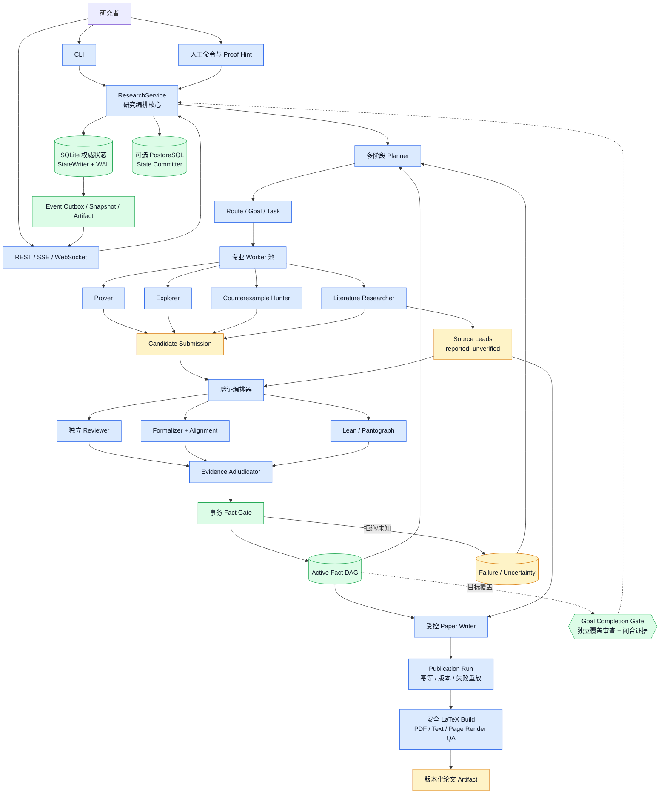
```mermaid
flowchart TB
    U[研究者] --> CLI[CLI]
    U --> API[REST / SSE / WebSocket]
    U --> CMD[人工命令与 Proof Hint]

    CLI --> CORE[ResearchService<br/>研究编排核心]
    API --> CORE
    CMD --> CORE

    CORE --> PLAN[多阶段 Planner]
    PLAN --> TASK[Route / Goal / Task]
    TASK --> WRK[专业 Worker 池]

    WRK --> PROVER[Prover]
    WRK --> EXPLORER[Explorer]
    WRK --> COUNTER[Counterexample Hunter]
    WRK --> LIT[Literature Researcher]

    PROVER --> CAND[Candidate Submission]
    EXPLORER --> CAND
    COUNTER --> CAND
    LIT --> SRC[Source Leads<br/>reported_unverified]
    LIT --> CAND

    CAND --> VERIFY[验证编排器]
    SRC --> VERIFY
    VERIFY --> REV[独立 Reviewer]
    VERIFY --> FORMAL[Formalizer + Alignment]
    VERIFY --> TOOLS[Lean / Pantograph]
    REV --> ADJ[Evidence Adjudicator]
    FORMAL --> ADJ
    TOOLS --> ADJ
    ADJ --> FG[事务 Fact Gate]

    FG --> FACT[(Active Fact DAG)]
    FG -->|拒绝/未知| LEDGER[(Failure / Uncertainty)]
    FACT --> PLAN
    LEDGER --> PLAN

    FACT --> WRITE[受控 Paper Writer]
    SRC --> WRITE
    WRITE --> PUB[Publication Run<br/>幂等 / 版本 / 失败重放]
    PUB --> PDF[安全 LaTeX Build<br/>PDF / Text / Page Render QA]
    PDF --> OUT[版本化论文 Artifact]

    CORE --> STORE[(SQLite 权威状态<br/>StateWriter + WAL)]
    CORE --> PG[(可选 PostgreSQL<br/>State Committer)]
    STORE --> EVENT[Event Outbox / Snapshot / Artifact]
    EVENT --> API

    GOAL{{Goal Completion Gate<br/>独立覆盖审查 + 闭合证据}}
    FACT -.目标覆盖.-> GOAL
    GOAL -.-> CORE

    classDef control fill:#dbeafe,stroke:#2563eb,color:#111827;
    classDef trusted fill:#dcfce7,stroke:#16a34a,color:#111827;
    classDef untrusted fill:#fef3c7,stroke:#d97706,color:#111827;
    classDef gap fill:#fee2e2,stroke:#dc2626,stroke-width:2px,stroke-dasharray:6 4,color:#111827;
    class CLI,API,CMD,CORE,PLAN,TASK,WRK,PROVER,EXPLORER,COUNTER,LIT,VERIFY,REV,FORMAL,TOOLS,ADJ,WRITE,PUB,PDF control;
    class FACT,FG,STORE,PG,EVENT trusted;
    class CAND,SRC,OUT,LEDGER untrusted;
    class GOAL trusted;
```

这张图的关键点是：Planner、Worker、Reviewer、Formalizer、Lean/Pantograph 和 API 都不能直接写入 Fact。数学结论成为权威知识的唯一入口是存储层事务 Fact Gate。

## 2. Rust workspace 代码分层

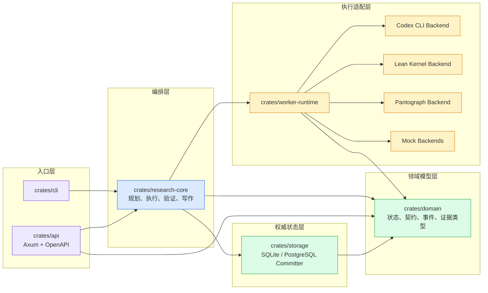
```mermaid
flowchart LR
    subgraph Entry[入口层]
        CLI[crates/cli]
        API[crates/api<br/>Axum + OpenAPI]
    end

    subgraph Orchestration[编排层]
        CORE[crates/research-core<br/>规划、执行、验证、写作]
    end

    subgraph Runtime[执行适配层]
        RT[crates/worker-runtime]
        CODEX[Codex CLI Backend]
        LEAN[Lean Kernel Backend]
        PANTO[Pantograph Backend]
        MOCK[Mock Backends]
    end

    subgraph Authority[权威状态层]
        STORE[crates/storage<br/>SQLite / PostgreSQL Committer]
    end

    subgraph Model[领域模型层]
        DOMAIN[crates/domain<br/>状态、契约、事件、证据类型]
    end

    CLI --> CORE
    API --> CORE
    CORE --> RT
    CORE --> STORE
    CORE --> DOMAIN
    API --> DOMAIN
    STORE --> DOMAIN
    RT --> DOMAIN
    RT --> CODEX
    RT --> LEAN
    RT --> PANTO
    RT --> MOCK

    classDef entry fill:#ede9fe,stroke:#7c3aed;
    classDef core fill:#dbeafe,stroke:#2563eb;
    classDef storage fill:#dcfce7,stroke:#16a34a;
    classDef runtime fill:#fef3c7,stroke:#d97706;
    class CLI,API entry;
    class CORE core;
    class STORE,DOMAIN storage;
    class RT,CODEX,LEAN,PANTO,MOCK runtime;
```

### 各 crate 的职责

| Crate | 当前职责 | 不应承担的职责 |
|---|---|---|
| `domain` | 领域对象、状态枚举、任务与证据契约 | 数据库 I/O、调用模型 |
| `storage` | 权威状态、事务、Fact Gate、恢复、事件和 outbox | 数学推理、模型提示词 |
| `worker-runtime` | Codex CLI、Lean、Pantograph 和 mock 的受控执行 | 直接改 Fact 或项目终态 |
| `research-core` | 研究循环、规划、worker 调度、验证编排、发布编排 | 绕开 storage 直接提交可信事实 |
| `api` | HTTP、SSE、WebSocket、鉴权、OpenAPI | 自行实现第二套领域逻辑 |
| `cli` | 本地创建、运行、服务、发布、诊断入口 | 成为独立权威状态源 |

## 3. 一轮研究的端到端时序

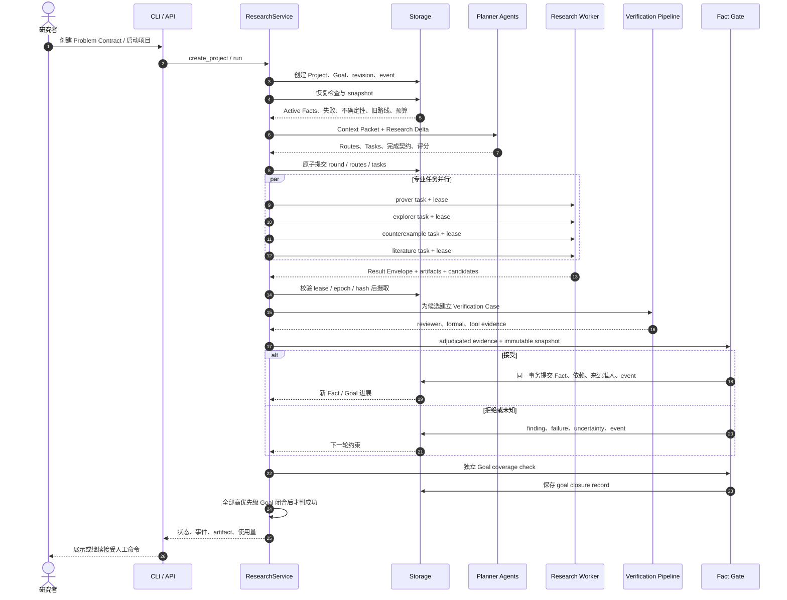
```mermaid
sequenceDiagram
    autonumber
    actor Human as 研究者
    participant Entry as CLI / API
    participant Core as ResearchService
    participant DB as Storage
    participant Planner as Planner Agents
    participant Worker as Research Worker
    participant Verify as Verification Pipeline
    participant Gate as Fact Gate

    Human->>Entry: 创建 Problem Contract / 启动项目
    Entry->>Core: create_project / run
    Core->>DB: 创建 Project、Goal、revision、event
    Core->>DB: 恢复检查与 snapshot
    DB-->>Core: Active Facts、失败、不确定性、旧路线、预算

    Core->>Planner: Context Packet + Research Delta
    Planner-->>Core: Routes、Tasks、完成契约、评分
    Core->>DB: 原子提交 round / routes / tasks

    par 专业任务并行
        Core->>Worker: prover task + lease
        Core->>Worker: explorer task + lease
        Core->>Worker: counterexample task + lease
        Core->>Worker: literature task + lease
    end

    Worker-->>Core: Result Envelope + artifacts + candidates
    Core->>DB: 校验 lease / epoch / hash 后摄取
    Core->>Verify: 为候选建立 Verification Case
    Verify-->>Core: reviewer、formal、tool evidence
    Core->>Gate: adjudicated evidence + immutable snapshot

    alt 接受
        Gate->>DB: 同一事务提交 Fact、依赖、来源准入、event
        DB-->>Core: 新 Fact / Goal 进展
    else 拒绝或未知
        Gate->>DB: finding、failure、uncertainty、event
        DB-->>Core: 下一轮约束
    end

    Core->>Gate: 独立 Goal coverage check
    Gate->>DB: 保存 goal closure record
    Core->>Core: 全部高优先级 Goal 闭合后才判成功
    Core-->>Entry: 状态、事件、artifact、使用量
    Entry-->>Human: 展示或继续接受人工命令
```

## 4. 规划层：多阶段路线产生与治理

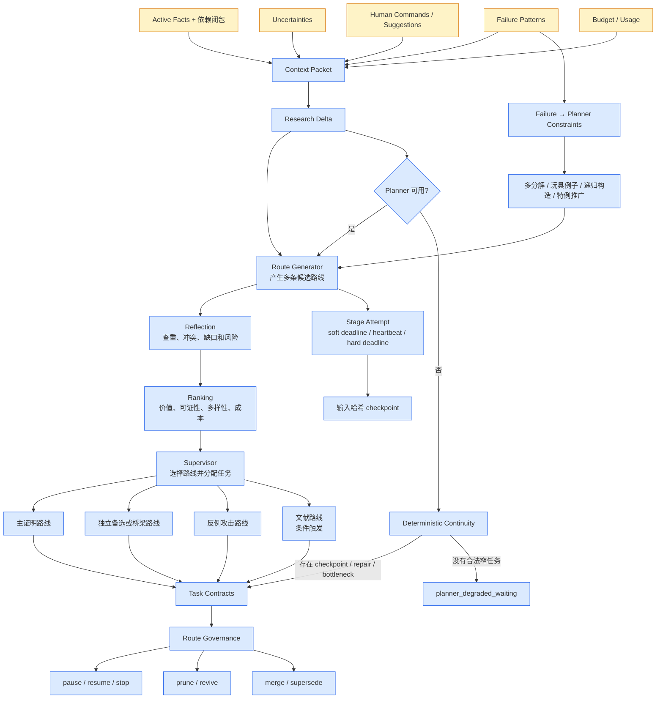
```mermaid
flowchart TB
    CTX[Context Packet] --> DELTA[Research Delta]
    FACTS[Active Facts + 依赖闭包] --> CTX
    UNC[Uncertainties] --> CTX
    FAIL[Failure Patterns] --> CTX
    HUMAN[Human Commands / Suggestions] --> CTX
    BUDGET[Budget / Usage] --> CTX

    DELTA --> RG[Route Generator<br/>产生多条候选路线]
    RG --> RF[Reflection<br/>查重、冲突、缺口和风险]
    RF --> RK[Ranking<br/>价值、可证性、多样性、成本]
    RK --> SV[Supervisor<br/>选择路线并分配任务]

    SV --> MAIN[主证明路线]
    SV --> ALT[独立备选或桥梁路线]
    SV --> ATTACK[反例攻击路线]
    SV --> LITERATURE[文献路线<br/>条件触发]

    MAIN --> TASKS[Task Contracts]
    ALT --> TASKS
    ATTACK --> TASKS
    LITERATURE --> TASKS

    TASKS --> ROUTE_GOV[Route Governance]
    ROUTE_GOV --> PAUSE[pause / resume / stop]
    ROUTE_GOV --> PRUNE[prune / revive]
    ROUTE_GOV --> MERGE[merge / supersede]

    CIRCUIT{Planner 可用?}
    DELTA --> CIRCUIT
    CIRCUIT -->|是| RG
    CIRCUIT -->|否| CONT[Deterministic Continuity]
    CONT -->|存在 checkpoint / repair / bottleneck| TASKS
    CONT -->|没有合法窄任务| WAIT[planner_degraded_waiting]

    FAIL --> CONSTRAINT[Failure → Planner Constraints]
    CONSTRAINT --> ADAPT[多分解 / 玩具例子 / 递归构造 / 特例推广]
    ADAPT --> RG
    RG --> ATTEMPT[Stage Attempt<br/>soft deadline / heartbeat / hard deadline]
    ATTEMPT --> CHECKPOINT[输入哈希 checkpoint]

    classDef implemented fill:#dbeafe,stroke:#2563eb;
    classDef data fill:#fef3c7,stroke:#d97706;
    classDef gap fill:#fee2e2,stroke:#dc2626,stroke-dasharray:6 4;
    class CTX,DELTA,RG,RF,RK,SV,MAIN,ALT,ATTACK,LITERATURE,TASKS,ROUTE_GOV,PAUSE,PRUNE,MERGE,CIRCUIT,CONT,WAIT,CONSTRAINT,ADAPT,ATTEMPT,CHECKPOINT implemented;
    class FACTS,UNC,FAIL,HUMAN,BUDGET data;
```

Planner 已具备路线生成、反思、排序、监督、失败约束编译和降级连续性。软截止用于标记慢阶段并继续到硬截止，完成输出按输入哈希复用；真正的剩余问题是用 Case 03 等真实难题证明这些控制策略能稳定提升全局构造发现率。

## 5. Worker 与任务生命周期

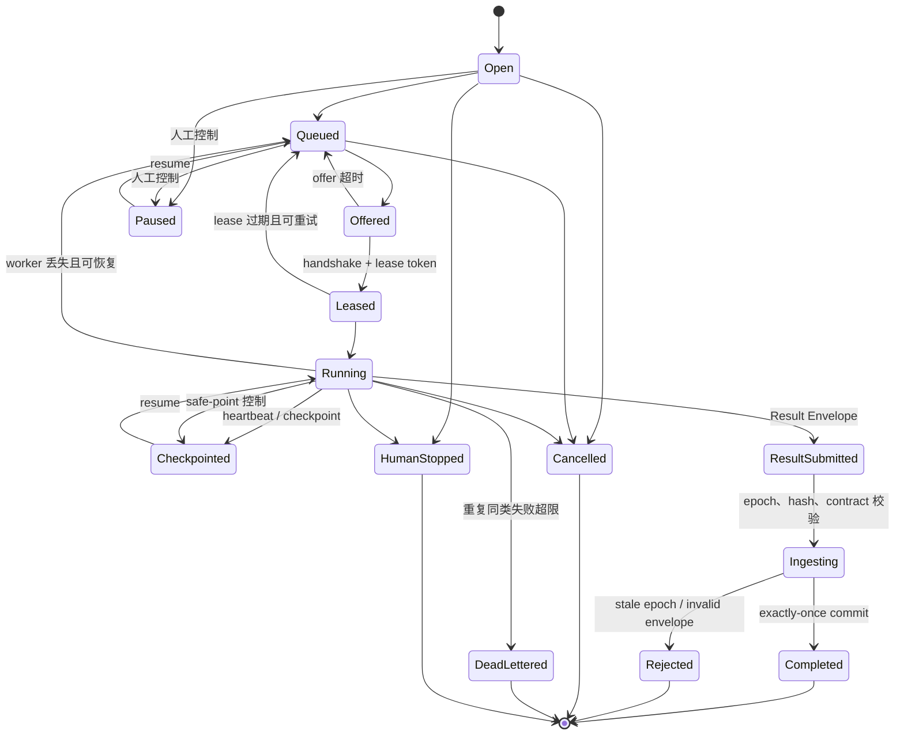
```mermaid
stateDiagram-v2
    [*] --> Open
    Open --> Queued
    Queued --> Offered
    Offered --> Leased: handshake + lease token
    Leased --> Running
    Running --> Checkpointed: heartbeat / checkpoint
    Checkpointed --> Running: resume
    Running --> ResultSubmitted: Result Envelope
    ResultSubmitted --> Ingesting: epoch、hash、contract 校验
    Ingesting --> Completed: exactly-once commit

    Offered --> Queued: offer 超时
    Leased --> Queued: lease 过期且可重试
    Running --> Queued: worker 丢失且可恢复
    Running --> DeadLettered: 重复同类失败超限
    Ingesting --> Rejected: stale epoch / invalid envelope

    Open --> Paused: 人工控制
    Queued --> Paused: 人工控制
    Running --> Checkpointed: safe-point 控制
    Paused --> Queued: resume
    Open --> Cancelled
    Queued --> Cancelled
    Running --> Cancelled
    Open --> HumanStopped
    Running --> HumanStopped

    Completed --> [*]
    Rejected --> [*]
    Cancelled --> [*]
    DeadLettered --> [*]
    HumanStopped --> [*]
```

每次执行不是一次无状态模型调用，而是：

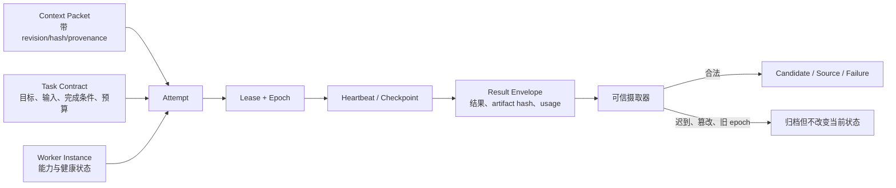
```mermaid
flowchart LR
    CP[Context Packet<br/>带 revision/hash/provenance]
    TC[Task Contract<br/>目标、输入、完成条件、预算]
    WI[Worker Instance<br/>能力与健康状态]
    AT[Attempt]
    LS[Lease + Epoch]
    HB[Heartbeat / Checkpoint]
    RE[Result Envelope<br/>结果、artifact hash、usage]
    ING[可信摄取器]

    CP --> AT
    TC --> AT
    WI --> AT
    AT --> LS --> HB --> RE --> ING
    ING -->|合法| NEXT[Candidate / Source / Failure]
    ING -->|迟到、篡改、旧 epoch| ARCH[归档但不改变当前状态]
```

本地 Worker、远程 Worker、Reviewer、Formalizer、Alignment Agent、Lean 和 Pantograph 都被纳入同一类受监督运行语义。

## 6. 候选结论的验证与 Fact Gate

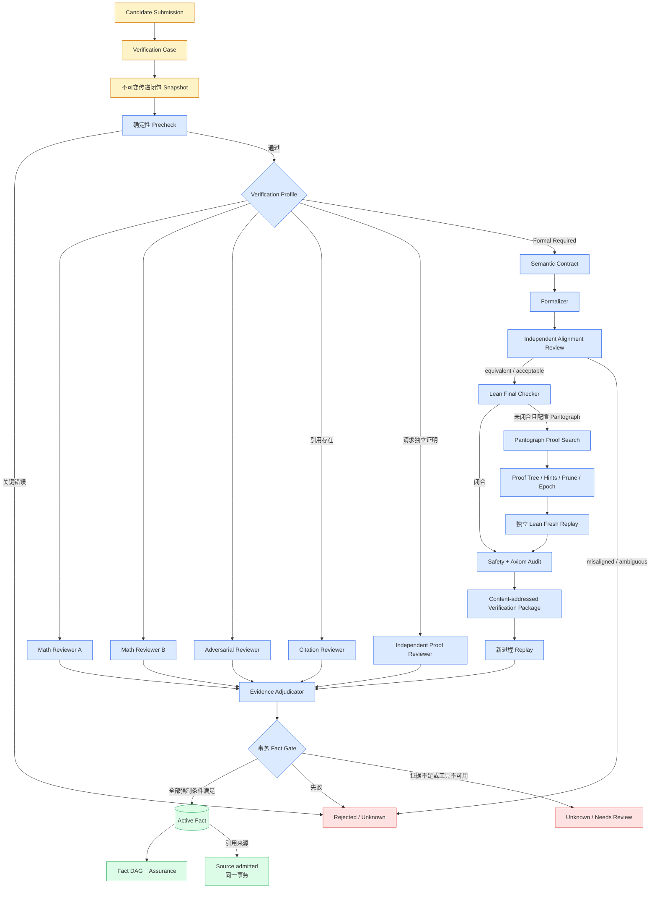
```mermaid
flowchart TB
    C[Candidate Submission] --> CASE[Verification Case]
    CASE --> SNAP[不可变传递闭包 Snapshot]
    SNAP --> PRE[确定性 Precheck]

    PRE -->|关键错误| REJECT[Rejected / Unknown]
    PRE -->|通过| PROFILE{Verification Profile}

    PROFILE --> R1[Math Reviewer A]
    PROFILE --> R2[Math Reviewer B]
    PROFILE --> ADV[Adversarial Reviewer]
    PROFILE -->|引用存在| CIT[Citation Reviewer]
    PROFILE -->|请求独立证明| R3[Independent Proof Reviewer]

    R1 --> ADJ[Evidence Adjudicator]
    R2 --> ADJ
    ADV --> ADJ
    CIT --> ADJ
    R3 --> ADJ

    PROFILE -->|Formal Required| SEM[Semantic Contract]
    SEM --> FML[Formalizer]
    FML --> ALIGN[Independent Alignment Review]
    ALIGN -->|equivalent / acceptable| LEAN[Lean Final Checker]
    ALIGN -->|misaligned / ambiguous| REJECT

    LEAN -->|闭合| AX[Safety + Axiom Audit]
    LEAN -->|未闭合且配置 Pantograph| SEARCH[Pantograph Proof Search]
    SEARCH --> TREE[Proof Tree / Hints / Prune / Epoch]
    TREE --> FRESH[独立 Lean Fresh Replay]
    FRESH --> AX
    AX --> PKG[Content-addressed Verification Package]
    PKG --> REPLAY[新进程 Replay]
    REPLAY --> ADJ

    ADJ --> GATE{事务 Fact Gate}
    GATE -->|全部强制条件满足| FACT[(Active Fact)]
    GATE -->|失败| REJECT
    GATE -->|证据不足或工具不可用| UNKNOWN[Unknown / Needs Review]

    FACT --> DAG[Fact DAG + Assurance]
    FACT -->|引用来源| ADMIT[Source admitted<br/>同一事务]

    classDef trusted fill:#dcfce7,stroke:#16a34a;
    classDef untrusted fill:#fef3c7,stroke:#d97706;
    classDef control fill:#dbeafe,stroke:#2563eb;
    classDef bad fill:#fee2e2,stroke:#dc2626;
    class C,CASE,SNAP untrusted;
    class PRE,PROFILE,R1,R2,ADV,CIT,R3,SEM,FML,ALIGN,LEAN,SEARCH,TREE,FRESH,AX,PKG,REPLAY,ADJ,GATE control;
    class FACT,DAG,ADMIT trusted;
    class REJECT,UNKNOWN bad;
```

### 验证层的两条主路径

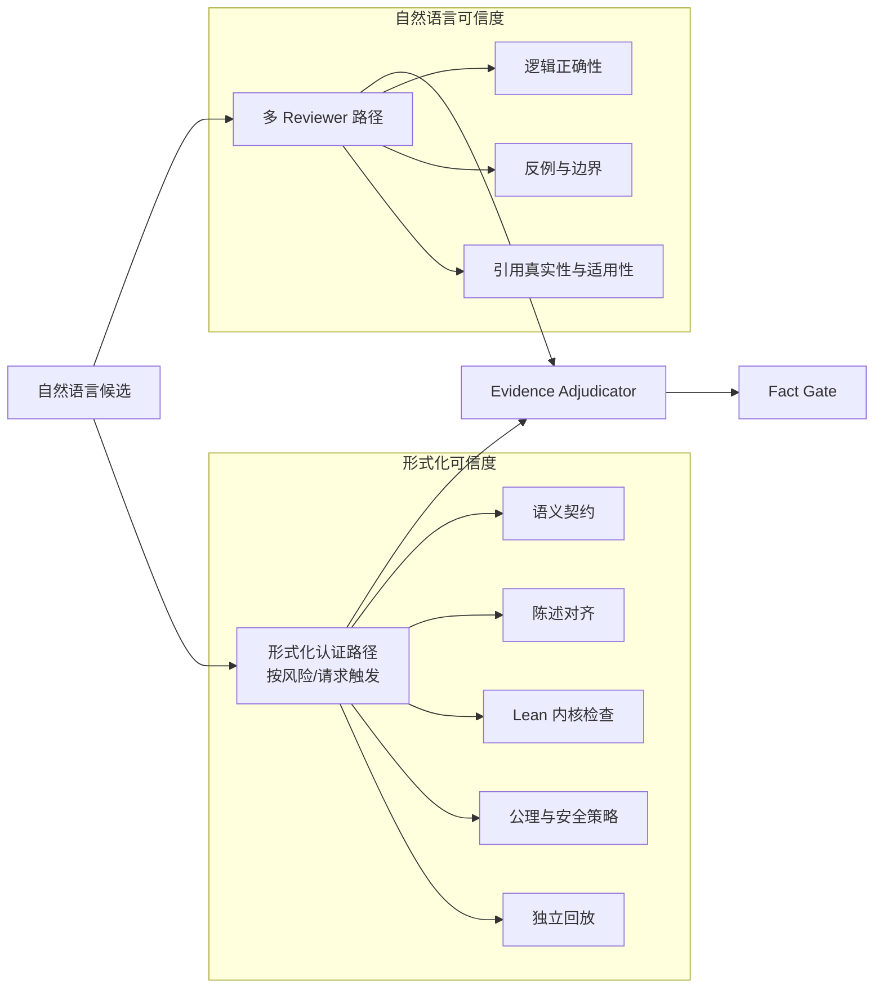
```mermaid
flowchart LR
    A[自然语言候选] --> N[多 Reviewer 路径]
    A --> F[形式化认证路径<br/>按风险/请求触发]
    N --> E[Evidence Adjudicator]
    F --> E
    E --> G[Fact Gate]

    subgraph Natural[自然语言可信度]
        N --> N1[逻辑正确性]
        N --> N2[反例与边界]
        N --> N3[引用真实性与适用性]
    end

    subgraph Formal[形式化可信度]
        F --> F1[语义契约]
        F --> F2[陈述对齐]
        F --> F3[Lean 内核检查]
        F --> F4[公理与安全策略]
        F --> F5[独立回放]
    end
```

形式化证明成功也不能单独写 Fact：若 Lean 陈述与自然语言候选不对齐，仍必须拒绝认证。

## 7. 信任边界

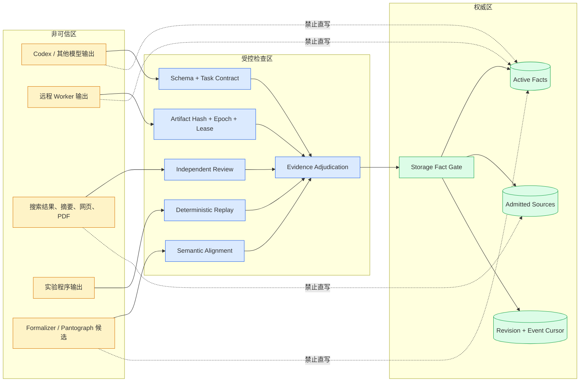
```mermaid
flowchart LR
    subgraph Untrusted[非可信区]
        MODEL[Codex / 其他模型输出]
        REMOTE[远程 Worker 输出]
        WEB[搜索结果、摘要、网页、PDF]
        CODE[实验程序输出]
        FORMOUT[Formalizer / Pantograph 候选]
    end

    subgraph Controlled[受控检查区]
        CONTRACT[Schema + Task Contract]
        HASH[Artifact Hash + Epoch + Lease]
        REVIEW[Independent Review]
        REPLAY[Deterministic Replay]
        ALIGN[Semantic Alignment]
        ADJ[Evidence Adjudication]
    end

    subgraph Authority[权威区]
        FG[Storage Fact Gate]
        FACT[(Active Facts)]
        SOURCE[(Admitted Sources)]
        EVENT[(Revision + Event Cursor)]
    end

    MODEL --> CONTRACT
    REMOTE --> HASH
    WEB --> REVIEW
    CODE --> REPLAY
    FORMOUT --> ALIGN
    CONTRACT --> ADJ
    HASH --> ADJ
    REVIEW --> ADJ
    REPLAY --> ADJ
    ALIGN --> ADJ
    ADJ --> FG
    FG --> FACT
    FG --> SOURCE
    FG --> EVENT

    MODEL -.禁止直写.-> FACT
    REMOTE -.禁止直写.-> FACT
    FORMOUT -.禁止直写.-> FACT
    WEB -.禁止直写.-> SOURCE

    classDef untrusted fill:#fef3c7,stroke:#d97706;
    classDef control fill:#dbeafe,stroke:#2563eb;
    classDef trusted fill:#dcfce7,stroke:#16a34a;
    class MODEL,REMOTE,WEB,CODE,FORMOUT untrusted;
    class CONTRACT,HASH,REVIEW,REPLAY,ALIGN,ADJ control;
    class FG,FACT,SOURCE,EVENT trusted;
```

这是当前系统最重要、也最不应为了模仿其他 Agent 而削弱的架构约束。

## 8. 文献、事实与论文写作链

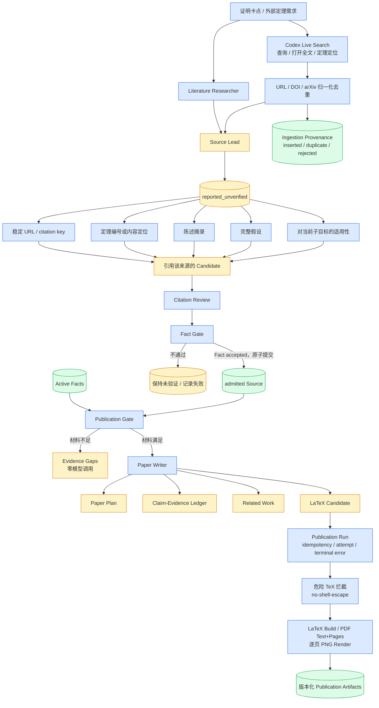
```mermaid
flowchart TB
    NEED[证明卡点 / 外部定理需求] --> LIT[Literature Researcher]
    LIT --> LEAD[Source Lead]
    LEAD --> RU[(reported_unverified)]

    RU --> META[稳定 URL / citation key]
    RU --> LOC[定理编号或内容定位]
    RU --> STMT[陈述摘录]
    RU --> ASM[完整假设]
    RU --> APP[对当前子目标的适用性]

    META --> CAND[引用该来源的 Candidate]
    LOC --> CAND
    STMT --> CAND
    ASM --> CAND
    APP --> CAND

    CAND --> CIT[Citation Review]
    CIT --> FG[Fact Gate]
    FG -->|Fact accepted，原子提交| ADM[(admitted Source)]
    FG -->|不通过| KEEP[(保持未验证 / 记录失败)]

    FACT[(Active Facts)] --> PUB[Publication Gate]
    ADM --> PUB
    PUB -->|材料不足| GAP[Evidence Gaps<br/>零模型调用]
    PUB -->|材料满足| WRITER[Paper Writer]
    WRITER --> PLAN[Paper Plan]
    WRITER --> LEDGER[Claim-Evidence Ledger]
    WRITER --> RW[Related Work]
    WRITER --> TEX[LaTeX Candidate]

    NEED --> SEARCH[Codex Live Search<br/>查询 / 打开全文 / 定理定位]
    SEARCH --> DEDUPE[URL / DOI / arXiv 归一化去重]
    DEDUPE --> LEAD
    DEDUPE --> INGEST[(Ingestion Provenance<br/>inserted / duplicate / rejected)]

    TEX --> RUN[Publication Run<br/>idempotency / attempt / terminal error]
    RUN --> SAFE[危险 TeX 拦截<br/>no-shell-escape]
    SAFE --> QA[LaTeX Build / PDF Text+Pages<br/>逐页 PNG Render]
    QA --> ART[(版本化 Publication Artifacts)]

    classDef trusted fill:#dcfce7,stroke:#16a34a;
    classDef untrusted fill:#fef3c7,stroke:#d97706;
    classDef control fill:#dbeafe,stroke:#2563eb;
    classDef gap fill:#fee2e2,stroke:#dc2626,stroke-dasharray:6 4;
    class FACT,ADM,INGEST,ART trusted;
    class LEAD,RU,CAND,KEEP,GAP,PLAN,LEDGER,RW,TEX untrusted;
    class NEED,LIT,META,LOC,STMT,ASM,APP,CIT,FG,PUB,WRITER,SEARCH,DEDUPE,RUN,SAFE,QA control;
```

当前文献层不仅保持“搜索材料不能直接成为事实”，还记录 live search 后的来源定位、归一化身份和每次摄取处置。适用来源的 PDF/TeX/HTML/TXT 必须保存到 Worker 工作区；可信核心验证路径边界、文件大小和 SHA-256 后才写入内容寻址 Artifact。写作层已经闭合到版本化 PDF 和逐页渲染；自动 QA 只证明构建与基本版面可读取，不替代人工审稿。

## 9. 数据与知识结构

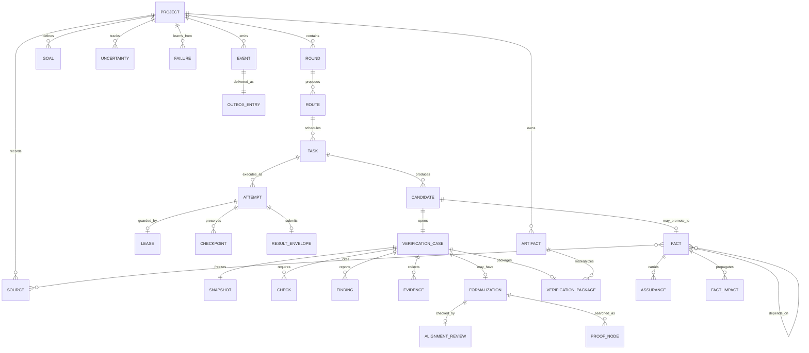
```mermaid
erDiagram
    PROJECT ||--o{ ROUND : contains
    PROJECT ||--o{ GOAL : defines
    PROJECT ||--o{ SOURCE : records
    PROJECT ||--o{ UNCERTAINTY : tracks
    PROJECT ||--o{ FAILURE : learns_from
    PROJECT ||--o{ EVENT : emits
    PROJECT ||--o{ ARTIFACT : owns

    ROUND ||--o{ ROUTE : proposes
    ROUTE ||--o{ TASK : schedules
    TASK ||--o{ ATTEMPT : executes_as
    ATTEMPT ||--o| LEASE : guarded_by
    ATTEMPT ||--o{ CHECKPOINT : preserves
    ATTEMPT ||--o| RESULT_ENVELOPE : submits

    TASK ||--o{ CANDIDATE : produces
    CANDIDATE ||--|| VERIFICATION_CASE : opens
    VERIFICATION_CASE ||--|| SNAPSHOT : freezes
    VERIFICATION_CASE ||--o{ CHECK : requires
    VERIFICATION_CASE ||--o{ FINDING : reports
    VERIFICATION_CASE ||--o{ EVIDENCE : collects
    VERIFICATION_CASE ||--o| FORMALIZATION : may_have
    FORMALIZATION ||--o| ALIGNMENT_REVIEW : checked_by
    FORMALIZATION ||--o{ PROOF_NODE : searched_as
    VERIFICATION_CASE ||--o| VERIFICATION_PACKAGE : packages

    CANDIDATE ||--o| FACT : may_promote_to
    FACT }o--o{ FACT : depends_on
    FACT }o--o{ SOURCE : cites
    FACT ||--o{ ASSURANCE : carries
    FACT ||--o{ FACT_IMPACT : propagates

    EVENT ||--|| OUTBOX_ENTRY : delivered_as
    ARTIFACT ||--o{ VERIFICATION_PACKAGE : materializes
```

### 权威关系

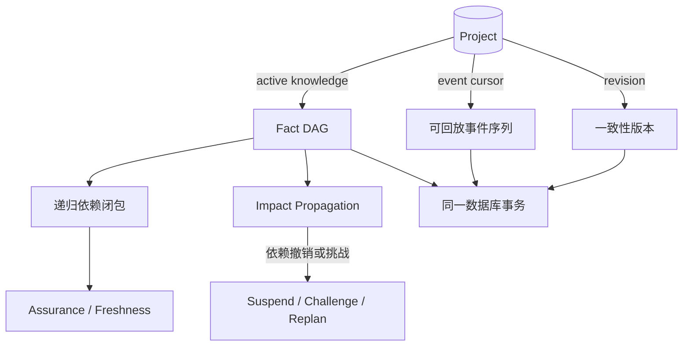
```mermaid
flowchart TB
    P[(Project)] -->|revision| R[一致性版本]
    P -->|event cursor| E[可回放事件序列]
    P -->|active knowledge| F[Fact DAG]
    F --> D[递归依赖闭包]
    D --> A[Assurance / Freshness]
    F --> I[Impact Propagation]
    I -->|依赖撤销或挑战| S[Suspend / Challenge / Replan]
    R --> TX[同一数据库事务]
    E --> TX
    F --> TX
```

项目 revision、event cursor 和领域状态变更在同一事务内提交，避免“数据库显示已完成但事件没有记录”或相反的分裂状态。

## 10. SQLite 与 PostgreSQL 的部署边界

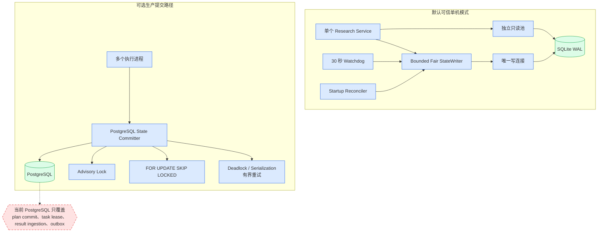
```mermaid
flowchart TB
    subgraph Local[默认可信单机模式]
        SERVICE[单个 Research Service]
        SW[Bounded Fair StateWriter]
        WC[唯一写连接]
        SQLITE[(SQLite WAL)]
        RP[独立只读池]
        WATCH[30 秒 Watchdog]
        REC[Startup Reconciler]

        SERVICE --> SW --> WC --> SQLITE
        SERVICE --> RP --> SQLITE
        WATCH --> SW
        REC --> SW
    end

    subgraph Production[可选生产提交路径]
        MULTI[多个执行进程]
        PSC[PostgreSQL State Committer]
        PG[(PostgreSQL)]
        LOCK[Advisory Lock]
        SKIP[FOR UPDATE SKIP LOCKED]
        RETRY[Deadlock / Serialization<br/>有界重试]

        MULTI --> PSC --> PG
        PSC --> LOCK
        PSC --> SKIP
        PSC --> RETRY
    end

    LIMIT{{当前 PostgreSQL 只覆盖<br/>plan commit、task lease、result ingestion、outbox}}
    PG -.-> LIMIT

    classDef local fill:#dbeafe,stroke:#2563eb;
    classDef trusted fill:#dcfce7,stroke:#16a34a;
    classDef gap fill:#fee2e2,stroke:#dc2626,stroke-dasharray:6 4;
    class SERVICE,SW,WC,RP,WATCH,REC,MULTI,PSC,LOCK,SKIP,RETRY local;
    class SQLITE,PG trusted;
    class LIMIT gap;
```

SQLite 是默认完整运行模式；PostgreSQL 当前是生产 State Committer，不应被描述成已经实现了全业务 PostgreSQL Repository。

## 11. 崩溃恢复与迟到结果防护

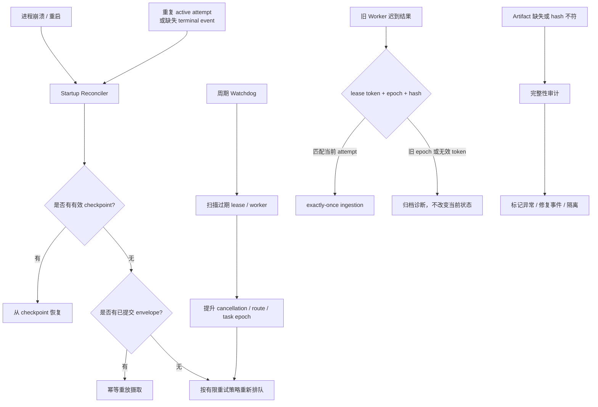
```mermaid
flowchart TB
    CRASH[进程崩溃 / 重启] --> REC[Startup Reconciler]
    REC --> L1{是否有有效 checkpoint?}
    L1 -->|有| RESUME[从 checkpoint 恢复]
    L1 -->|无| L2{是否有已提交 envelope?}
    L2 -->|有| REPLAY[幂等重放摄取]
    L2 -->|无| RETRY[按有限重试策略重新排队]

    WATCH[周期 Watchdog] --> EXPIRE[扫描过期 lease / worker]
    EXPIRE --> EPOCH[提升 cancellation / route / task epoch]
    EPOCH --> RETRY

    LATE[旧 Worker 迟到结果] --> VALIDATE{lease token + epoch + hash}
    VALIDATE -->|匹配当前 attempt| INGEST[exactly-once ingestion]
    VALIDATE -->|旧 epoch 或无效 token| ARCHIVE[归档诊断，不改变当前状态]

    TAMPER[Artifact 缺失或 hash 不符] --> AUDIT[完整性审计]
    AUDIT --> QUAR[标记异常 / 修复事件 / 隔离]

    DUP[重复 active attempt<br/>或缺失 terminal event] --> REC
```

验证阶段重启时不会信任孤儿验证进程的结果，而是提升取消 epoch 后重新进行独立验证。

## 12. API、事件与人工控制面

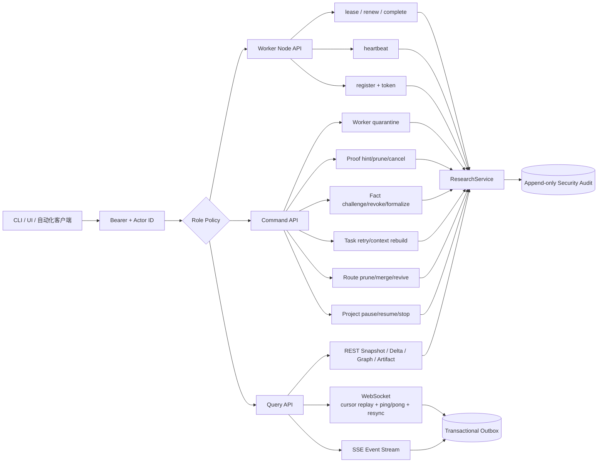
```mermaid
flowchart LR
    CLIENT[CLI / UI / 自动化客户端] --> AUTH[Bearer + Actor ID]
    AUTH --> ROLE{Role Policy}

    ROLE --> QUERY[Query API]
    ROLE --> COMMAND[Command API]
    ROLE --> WORKER[Worker Node API]

    QUERY --> REST[REST Snapshot / Delta / Graph / Artifact]
    QUERY --> SSE[SSE Event Stream]
    QUERY --> WS[WebSocket<br/>cursor replay + ping/pong + resync]

    COMMAND --> PROJECT[Project pause/resume/stop]
    COMMAND --> ROUTE[Route prune/merge/revive]
    COMMAND --> TASK[Task retry/context rebuild]
    COMMAND --> FACT[Fact challenge/revoke/formalize]
    COMMAND --> PROOF[Proof hint/prune/cancel]
    COMMAND --> INSTANCE[Worker quarantine]

    WORKER --> REGISTER[register + token]
    WORKER --> HEARTBEAT[heartbeat]
    WORKER --> LEASE[lease / renew / complete]

    REST --> CORE[ResearchService]
    SSE --> OUTBOX[(Transactional Outbox)]
    WS --> OUTBOX
    PROJECT --> CORE
    ROUTE --> CORE
    TASK --> CORE
    FACT --> CORE
    PROOF --> CORE
    INSTANCE --> CORE
    REGISTER --> CORE
    HEARTBEAT --> CORE
    LEASE --> CORE

    CORE --> AUDIT[(Append-only Security Audit)]
```

API 默认监听 loopback。非 loopback 启动要求已经 bootstrap 管理员，并由可信反向代理负责 TLS 终结。

## 13. 项目、轮次与事实的状态关系

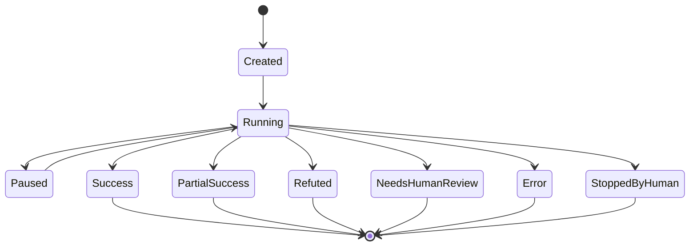
```mermaid
stateDiagram-v2
    [*] --> Created
    Created --> Running
    Running --> Paused
    Paused --> Running
    Running --> Success
    Running --> PartialSuccess
    Running --> Refuted
    Running --> NeedsHumanReview
    Running --> Error
    Running --> StoppedByHuman

    Success --> [*]
    PartialSuccess --> [*]
    Refuted --> [*]
    NeedsHumanReview --> [*]
    Error --> [*]
    StoppedByHuman --> [*]
```

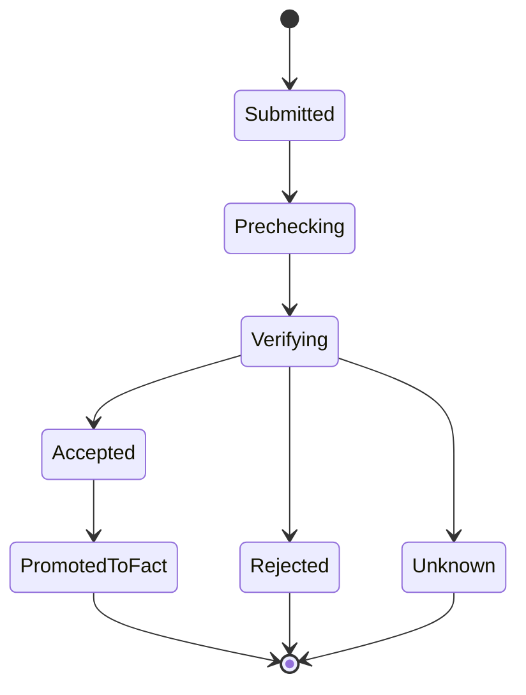
```mermaid
stateDiagram-v2
    [*] --> Submitted
    Submitted --> Prechecking
    Prechecking --> Verifying
    Verifying --> Accepted
    Verifying --> Rejected
    Verifying --> Unknown
    Accepted --> PromotedToFact
    PromotedToFact --> [*]
    Rejected --> [*]
    Unknown --> [*]
```

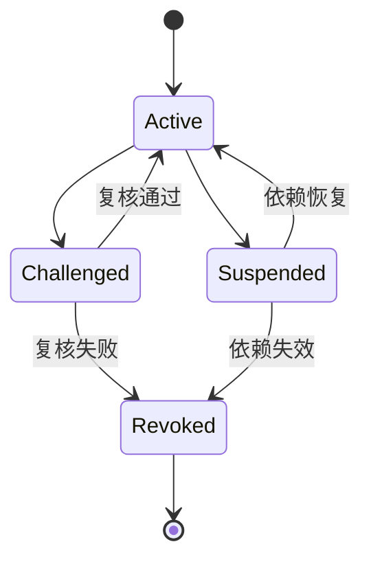
```mermaid
stateDiagram-v2
    [*] --> Active
    Active --> Challenged
    Active --> Suspended
    Challenged --> Active: 复核通过
    Challenged --> Revoked: 复核失败
    Suspended --> Active: 依赖恢复
    Suspended --> Revoked: 依赖失效
    Revoked --> [*]
```

`Success` / `PartialSuccess` 的进入条件已经与 Fact 准入分离：Fact 被接受只表示局部主张可信；目标还必须通过独立 coverage check，并写入绑定 Goal、Fact、Verification 和 Check 的闭合记录。项目只有在全部高优先级目标 solved/refuted 且无高危阻塞不确定性时才进入成功终态。

## 14. 当前架构的“已实现—部分实现—缺口”地图

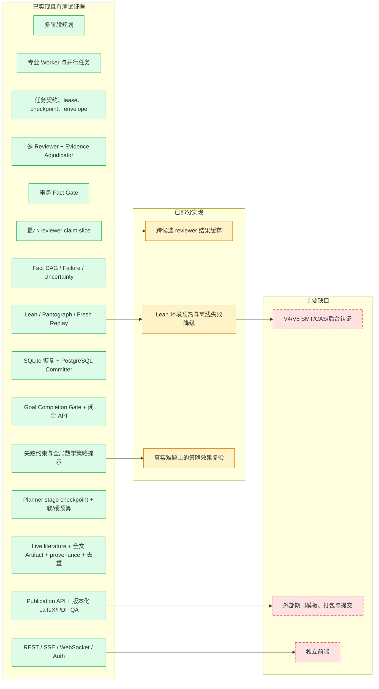
```mermaid
flowchart LR
    subgraph Done[已实现且有测试证据]
        D1[多阶段规划]
        D2[专业 Worker 与并行任务]
        D3[任务契约、lease、checkpoint、envelope]
        D4[多 Reviewer + Evidence Adjudicator]
        D5[事务 Fact Gate]
        D6[Lean / Pantograph / Fresh Replay]
        D7[Fact DAG / Failure / Uncertainty]
        D8[REST / SSE / WebSocket / Auth]
        D9[SQLite 恢复 + PostgreSQL Committer]
        D10[Goal Completion Gate + 闭合 API]
        D11[失败约束与全局数学策略提示]
        D12[Planner stage checkpoint + 软/硬预算]
        D13[Live literature + 全文 Artifact + provenance + 去重]
        D14[Publication API + 版本化 LaTeX/PDF QA]
        D15[最小 reviewer claim slice]
    end

    subgraph Partial[已部分实现]
        P1[跨候选 reviewer 结果缓存]
        P2[Lean 环境预热与离线失败降级]
        P3[真实难题上的策略效果复验]
    end

    subgraph Gap[主要缺口]
        G1[V4/V5 SMT/CAS/后台认证]
        G2[外部期刊模板、打包与提交]
        G3[独立前端]
    end

    D15 --> P1
    D6 --> P2 --> G1
    D11 --> P3
    D14 --> G2
    D8 --> G3

    classDef done fill:#dcfce7,stroke:#16a34a;
    classDef partial fill:#fef3c7,stroke:#d97706;
    classDef gap fill:#fee2e2,stroke:#dc2626,stroke-dasharray:6 4;
    class D1,D2,D3,D4,D5,D6,D7,D8,D9,D10,D11,D12,D13,D14,D15 done;
    class P1,P2,P3 partial;
    class G1,G2,G3 gap;
```

## 15. 当前最关键的审阅路径

如果只审阅五条链路，建议依次检查：

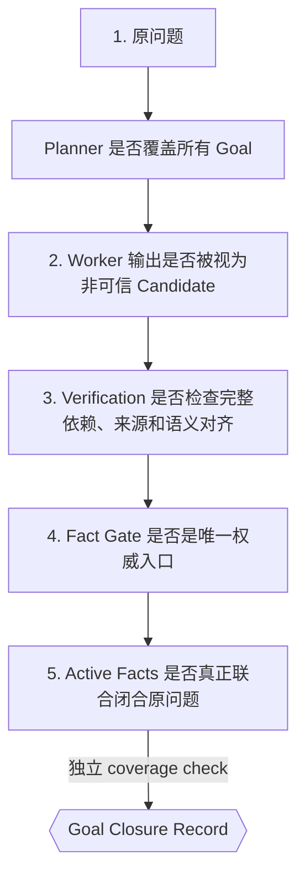
```mermaid
flowchart TB
    A[1. 原问题] --> B[Planner 是否覆盖所有 Goal]
    B --> C[2. Worker 输出是否被视为非可信 Candidate]
    C --> D[3. Verification 是否检查完整依赖、来源和语义对齐]
    D --> E[4. Fact Gate 是否是唯一权威入口]
    E --> F[5. Active Facts 是否真正联合闭合原问题]

    F -->|独立 coverage check| G{{Goal Closure Record}}
```

审阅时应把两个问题分开：

1. **局部事实是否可信？** 当前架构对此控制较强。
2. **这些可信事实是否完整回答原问题？** 当前由独立 Goal Completion Gate 控制，并可通过 closure API 审阅证据；复杂语义关系仍需要 reviewer 而非字符串猜测。

## 16. 架构定位总结

```mermaid
quadrantChart
    title 当前架构能力分布
    x-axis 数学策略闭环较弱 --> 数学策略闭环较强
    y-axis 工程可信度较弱 --> 工程可信度较强
    quadrant-1 目标区域
    quadrant-2 当前优势区
    quadrant-3 不可接受区
    quadrant-4 快速原型区
    当前智能体: [0.53, 0.88]
    当前Rethlas式流程: [0.78, 0.47]
    下一阶段目标: [0.84, 0.91]
```

上图是架构性定位，不是统计评分。当前系统已经建立了高可信、可恢复的 Rust 基础设施，Goal Completion、失败反馈编译和真实文献执行链也已落地；同材料复测表明下一阶段应集中提高递归证明、全局不变量选择和整题组装的实际成功率，而不是继续横向增加更多角色。

## 17. 对应证据文件

- `IMPLEMENTATION_STATUS.md`：当前实现清单；
- `ARCHITECTURE_V2_V3_AUDIT.md`：验证层、总体架构和接口审计；
- `ARCHITECTURE_RELIABILITY_V2_AUDIT.md`：规划、执行、存储与恢复审计；
- `DECISIONS.md`：架构边界与决策记录；
- `当前智能体主要问题与Rethlas对比.md`：现有问题和与 Rethlas 的差距；
- `benchmarks/rethlas/runs/20260903-gap-closure-v3/POST_REMEDIATION_COMPARISON.md`：缺口修复后的 Case 03/10 同材料复测；
- `crates/research-core/src/lib.rs`：研究、验证与发布编排；
- `crates/storage/src/`：权威状态、Fact Gate、可靠性和 PostgreSQL Committer；
- `crates/worker-runtime/src/`：Codex CLI、Lean 与 Pantograph 执行适配；
- `crates/api/src/lib.rs`：HTTP、SSE、WebSocket 和权限入口。
